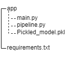
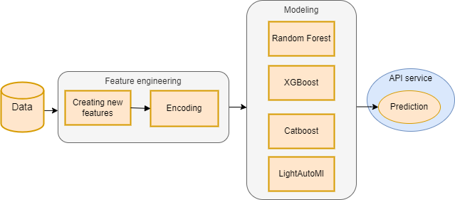

# Description
Within the framework of the project, an online service was developed using real data provided by the SberAutoSubscription. It is based on the machine learning model. The service allows to determine whether a user becomes a customer or not in real time.

This repository contains the required requirements (requirements.txt), data description file (data description.txt), "app" folder with .py files for running the project and model in pickle format, additional overview pictures (Diagram.png, scheme.png).

# Reproducing a project
+ Install the required python packages specified in requirements.txt.
+ Download files from the repository (structure is important)
  
+ Run uvicorn app.main:app –reload in terminal
+ Open postman/http://127.0.0.1:8000/docs 
+ Make a POST request (/predict)

# Methodology
The data represents information about customers who visited the website of the company that provides car leasing. The file ga_sessions.csv contains mostly information about clients, in ga_hits-001.csv data about marketing programs. The main goal of the study was to predict whether a site visitor would perform a targeted action expressing his willingness to become a customer and to develop a service that would predict if the user is ready to make specific actions. Examples of such actions are leaving a request or ordering a call. The obtained prediction about the user would inform the company how their marketing strategies are working and develop a personalized approach to clients. 

The first step was to examine the data, highlight the significant features and generate a dataset to work with. The final dataset contains data on 1732266 unique sessions and 1320 thousand website visitors. In total, the data was collected on 18 attributes. From more than 1.5 million visits of the website, users made a targeted action in 2.9% of cases. 

The next step was to work with the features. The data, gaps, distributions, relationships between attributes were analyzed. Nine new features were generated from the available data, and work such as filling in the gaps, removing outliers from the original data was performed. After that, the modeling was conducted. Based on the results of the metrics of the obtained models, a boosting model (xgboost) was chosen and hyperparameters were selected. The resulting model was automatically saved to a pickle file (Pickled_model.pkl). The service based on fastapi that allows using the model as an online service was created. 

# Workflow diagram

